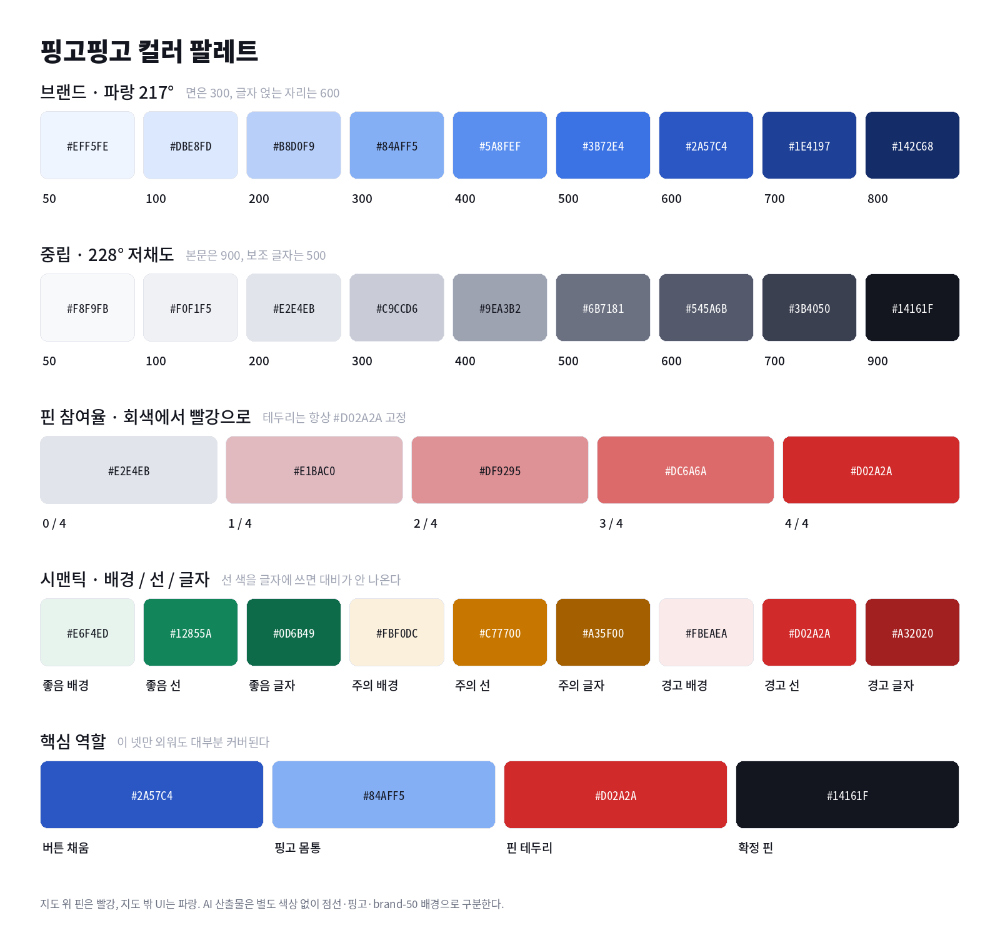

# 색 결정 (FE)

작성 2026-09-11 · 장현성
최종 갱신 2026-09-30 — 확정 핀 색을 검정에서 골드로 변경 (#149)

---

## ⚠️ 단일 소스

**색의 단일 소스는 `frontend/src/styles/tokens.css`다. 
이 문서의 표와 이미지는 사람이 읽기 위한 사본임.** 

**( 어긋나는 경우 색상 코드가 맞다. )**

---

## 한 줄 요약

브랜드는 파랑(`#84AFF5`), 지도 위 핀은 빨강 고정(확정 핀만 골드), AI 산출물은 별도 색상 없이 형태·화자·톤으로 구분한다.

> 💡 정확한 값은 항상 hex 코드를 보세요.



---

## 1. 결정 목록

| 항목 | 결정 | 상태 |
| --- | --- | --- |
| 브랜드 색 | 파랑 217° · `#84AFF5`(300) | 확정 |
| 버튼·액션 색 | `#2A57C4`(600) | 확정 |
| 지도 위 핀 색 | 빨강 `#D02A2A` 고정 | 확정 |
| 확정 핀 색 | 골드 `#F5B301` + 흰 테두리 3px + 그림자 (#149) | 확정 |
| 핀 색의 의미 | 그 장소에 의견을 남긴 사람의 비율 | 확정 |
| 핀 참여율의 분모 | 지도에 참여한 전체 구성원 수 (기획안 5-4의 온라인 N과 별개) | 확정 |
| 지도에 올린 AI 핀의 참여율 | 10월 실사용 보고 결정 | 미결 |
| 제안자별 핀 색 | 쓰지 않음 | 확정 |
| AI 전용 색상 | 만들지 않음 | 확정 |
| 마스코트 핑고 몸통 | `#84AFF5` | 확정 |
| 다크 모드 | v1 스코프 밖 | 확정 |
| Tailwind 매핑 방식 | Tailwind 4 확인(`frontend/package.json` `^4.3.3`) → OKLCH + `@theme inline` | 확정 |

---

## 2. 브랜드와 중립

### 왜 이 색인가?

마스코트 **핑고**의 색임. 
"AI가 추천했어요"라는 딱딱함을 덜어내려고 캐릭터를 사용하기로 했고, 
그러면 브랜드 색이 캐릭터 색과 유사하거나 같아야 한다고 판단. 
AI가 추천할 때 이외의 경우에 따로 사용하면 핑고가 마스코트가 아니라 그냥 단순 캐릭터 같이 보임.

#### 왜 `#84AFF5`가 500자리가 아니라 300 자리에 있을까?

명도가 74%라 흰 글자를 올리면 대비가 2.2:1이다. 
버튼 배경으로 쓸 수 없다는 결론.

그래서 역할을 나누려고 함. `#84AFF5`는 **면**에만 쓰는 것으로 결정. 
— 핑고 몸통, AI 카드 배경, 활성 상태 배경. **글자가 얹히는 자리**는 `#2A57C4`(600)를 쓰려고 한다. 
흰 글자 대비 6.5:1로 AA를 넘는다!

### 램프

|  | 단계 | 값 | 용도 |
| --- | --- | --- | --- |
| ⬜ | 50 | `#EFF5FE` | AI 카드 배경, 핑고 배너 |
| ⬜ | 100 | `#DBE8FD` | 선택된 칩 배경 |
| 🟦 | 200 | `#B8D0F9` | 비활성 테두리 |
| 🟦 | **300** | **`#84AFF5`** | **핑고 몸통, AI 영역 테두리** |
| 🟦 | 400 | `#5A8FEF` | 보조 액센트 |
| 🟦 | 500 | `#3B72E4` | 포커스 링 |
| 🟦 | **600** | **`#2A57C4`** | **버튼 채움, 링크, 활성 탭** |
| 🟦 | 700 | `#1E4197` | 버튼 hover, 강조 텍스트 |
| 🟦 | 800 | `#142C68` | 최고 강조 |

### 중립 램프

|  | 단계 | 값 | 용도 |
| --- | --- | --- | --- |
| ⬜ | 50 | `#F8F9FB` | 페이지 배경 |
| ⬜ | 100 | `#F0F1F5` | 눌린 면, 비활성 버튼 |
| ⬜ | 200 | `#E2E4EB` | 얇은 구분선, 핀 빈 속 |
| ⬜ | 300 | `#C9CCD6` | 컨트롤 테두리 |
| ⬛ | 400 | `#9EA3B2` | 희미한 글자, 미확인 반응 |
| ⬛ | 500 | `#6B7181` | 보조 글자 |
| ⬛ | 600 | `#545A6B` | 라벨 |
| ⬛ | 700 | `#3B4050` | 진한 라벨 |
| ⬛ | **900** | **`#14161F`** | **본문 글자** |

---

## 3. 지도 위 핀

### 핀 색은 참여율을 나타냄.

의견 제안자를 색으로 구분하지 않음.
색에 사람의 의견을 담지 않음.

**색**은 **그 장소에 의견을 남긴 사람의 비율을 나타냄.**

- 테두리는 참여율과 무관하게 항상 `#D02A2A` 실선 2.5px
- 속은 `#E2E4EB`(회색)에서 `#D02A2A`(빨강)로 참여율만큼 섞인다

테두리를 고정하는 이유는 0% 핀도 또렷하게 보여야 하기 때문이다. 의견이 하나도 없는 핀이 가장 눈에 띄어야 한다.

### 단계 예시 (구성원 4명)

|  | 참여 | 속 색 |
| --- | --- | --- |
| ⬜ | 0 / 4 | `#E2E4EB` |
| ⬜ | 1 / 4 | `#E1BAC0` |
| 🟥 | 2 / 4 | `#DF9295` |
| 🟥 | 3 / 4 | `#DC6A6A` |
| 🟥 | 4 / 4 | `#D02A2A` |

단계는 구성원 수만큼 끊는다. 연속값으로 두면 의미 없는 중간값이 나온다.

### 계산

```css
background: color-mix(in oklch,
  var(--pin-fill-full) var(--ratio),
  var(--pin-fill-empty));
```

- `--ratio`에 `참여한 사람 / 구성원 수`를 퍼센트로 넣는다. **oklch로 섞어야 한다.** sRGB로 섞으면 중간 단계가 탁한 회보라로 빠진다.

분자는 그 핀에 ♥/△/🚫 중 하나라도 남긴 사람 수, 분모는 **지도에 참여한 전체 구성원 수**다. 기획안 5-4 추천 버튼 임계값의 N(온라인 구성원 수)과 다르다 — 접속 상태에 따라 핀 색이 바뀌면 참여율이라는 뜻이 없어진다.

### 한계

1/4와 2/4는 나란히 놓아야 구분된다. 지도에 흩어져 있으면 "연한 편"과 "중간쯤" 정도로만 읽힌다. 색 하나에 여러 단계를 담는 방식의 구조적 한계다.

그래서 **바텀시트 상단에 `2/4명이 의견을 남겼어요`를 반드시 넣는다.** 색이 못 하는 일을 여기서 처리한다.

### 왜 파랑이 아니라 빨강인가

217° 파랑은 카카오맵 타일의 물 색과 같은 대역이다. 
바다·강이 화면의 상당 부분을 차지하는 지도에서 핀이 물 위에 떨어지면 사라진다.

브랜드는 파랑이다. 마스코트 핑고의 색이고, UI 전반이 이 색을 쓴다. 지도 위 핀은 빨강으로 따로 간다 
— 파랑은 카카오맵 타일의 물 색과 같은 대역이라 바다가 보이는 지도에서 핀이 묻힌다.

### 핀 3종

|  | 종류 | 모양 |
| --- | --- | --- |
| 🟥 | 일반 | `#D02A2A` 실선 2.5px + 참여율만큼 회색→빨강 |
| 🟨 | 확정 | `#F5B301` 채움 + 흰 테두리 3px + 그림자 + 갈색 ♥ `#6B4500` |
| 🟥 | AI 추천 | `#D02A2A` 점선 2.5px (dasharray 4 3) + 회색 속 |

**확정 핀은 참여율과 무관하게 골드로 꽉 채운다.** 확정은 집계가 아니라 사람이 직접 넣는 것이라(5-3) 두 축이 섞이면 안 된다.

처음엔 검정(`#14161F`)이었는데, 지도에서 너무 무겁고 서비스가 어두워 보였다. 브랜드 파랑 계열(brand-700 `#1E4197`)도 그려 봤지만 화면이 파랑 일색이 되어 가라앉아 보였다. 골드는 "확정 = 별·금메달"처럼 읽히고, 빨간 일반 핀·파란 UI와 색상이 확실히 갈린다. 지도 위에서는 반응 색을 쓰지 않으므로(6절) 조율 앰버와 뜻이 겹치지 않는다.

대신 골드는 밝아서 지도 타일과 대비가 낮다(땅 2.0:1 · 물 1.4:1 · 공원 1.7:1). 그래서 **흰 테두리 3px와 그림자가 가시성을 맡는다.** 둘 중 하나라도 빼면 바다 위에서 묻힌다. 골드 위 흰 글자는 읽히지 않으므로 ♥와 확정 리스트 순서 번호는 갈색 `#6B4500`으로 쓴다.

**AI 추천 핀에는 참여율을 넣지 않는다.** 「지도에 올리기」 전에는 나만 보는 핀이라 참여율이 항상 0이다. 올린 뒤 일반 핀처럼 차오르게 할지는 10월 실사용 보고 정한다.

---

## 4. AI가 만든 것과 사람이 만든 것 구분

### 색상을 추가하지 않는다

지금 파랑(UI)과 빨강(핀) 두 색이고, 지도 안팎으로 영역이 갈려서 성립한다. 여기에 AI 전용 색을 넣으면 세 개가 되는데, 파랑과 보라는 43° 차이라 영역으로 갈리지 않는다. AI 추천 탭 안에서 버튼은 파랑, 카드는 보라가 되고 사용자가 그 규칙을 학습해야 한다.

대신 세 층으로 구분한다.

### 1층 — 지도 위에서는 형태

점선이 AI 표시다. 색은 일반 핀과 같고 테두리 스타일만 다르다.

여기에 **AI 추천 핀 머리 안에 핑고 실루엣을 넣는다.** 일반 핀은 참여율 채움이 들어가는 자리지만 AI 핀은 속이 회색으로 비어 있어 자리가 남는다. 점선을 못 알아채도 펭귄은 알아챈다.

### 2층 — 카드와 배너는 톤

색상을 바꾸는 게 아니라 브랜드 램프 안에서 톤을 옮긴다.

| 출처 | 스타일 |
| --- | --- |
| 사람이 만든 것 | 흰 배경 + `--line-hairline` 테두리 |
| AI가 만든 것 | `--brand-50` 배경 + `--brand-300` 테두리 |

같은 파랑인데 AI 영역만 살짝 물든 상태다. 브랜드는 하나로 남고 화면에서는 확실히 갈린다.

적용 대상: AI 추천 탭 결과 카드, 근거 확인 화면, 정보 부족 화면(추천 준비 미달 5-4 · 결과 0개 6절), 로딩 단계 표시.

### 3층 — 화자는 핑고

**핑고가 있으면 AI가 말한 것, 없으면 사람이 남긴 것.** 가장 강한 구분이고 설명이 필요 없다.

다만 발화 영역을 잘라둔다.

| 핑고가 말한다 | 핑고가 말하지 않는다 |
| --- | --- |
| 추천 결과 | 꼭 지켜야 하는 조건 삭제 경고 (5-5) |
| 로딩 단계 표시 | 지역 분리 경고 (5-6-1) |
| 빈 상태 | 강퇴 확인 (v2, 기획안 11절) |
| 정보 부족 화면 (추천 준비 미달 5-4 · 결과 0개 6절) | "메뉴 확인 필요" (가드레일 8) |
| 온보딩 |  |

---

## 5. 토큰 정보 상세

|  | 역할 | 값 |
| --- | --- | --- |
| 🟦 | 버튼 채움 · 링크 · 활성 탭 | `#2A57C4` |
| 🟦 | 핑고 몸통 · AI 영역 | `#84AFF5` |
| 🟥 | 핀 테두리 · 파괴적 액션 | `#D02A2A` |
| ⬛ | 본문 글자 | `#14161F` |
| 🟨 | 확정 핀 · 확정 리스트 순서 번호 바탕 | `#F5B301` (위 글자·♥는 `#6B4500`) |

`frontend/src/styles/tokens.css`

```css
:root {
  /* ── 브랜드 · 파랑 217° ──────────────── */
  --brand-50:  #EFF5FE;  --brand-100: #DBE8FD;
  --brand-200: #B8D0F9;  --brand-300: #84AFF5;
  --brand-400: #5A8FEF;  --brand-500: #3B72E4;
  --brand-600: #2A57C4;  --brand-700: #1E4197;
  --brand-800: #142C68;

  /* ── 중립 · 228° 저채도 ──────────────── */
  --ink-50:  #F8F9FB;  --ink-100: #F0F1F5;
  --ink-200: #E2E4EB;  --ink-300: #C9CCD6;
  --ink-400: #9EA3B2;  --ink-500: #6B7181;
  --ink-600: #545A6B;  --ink-700: #3B4050;
  --ink-900: #14161F;

  /* ── 시맨틱 ──────────────────────────── */
  --good-bg: #E6F4ED;  --good-line: #12855A;  --good-text: #0D6B49;
  --warn-bg: #FBF0DC;  --warn-line: #C77700;  --warn-text: #A35F00;
  --bad-bg:  #FBEAEA;  --bad-line:  #D02A2A;  --bad-text:  #A32020;

  /* ── 면 ──────────────────────────────── */
  --surface-page:    var(--ink-50);
  --surface-card:    #FFFFFF;
  --surface-sunken:  var(--ink-100);
  --surface-overlay: #FFFFFF;
  --scrim:           rgba(20, 22, 31, 0.45);

  /* ── 글자 ────────────────────────────── */
  --text-primary:   var(--ink-900);
  --text-secondary: var(--ink-500);
  --text-muted:     var(--ink-400);
  --text-on-fill:   #FFFFFF;
  --text-link:      var(--brand-600);

  /* ── 선 ──────────────────────────────── */
  --line-hairline: var(--ink-200);
  --line-control:  var(--ink-300);
  --line-focus:    var(--brand-500);

  /* ── 액션 ────────────────────────────── */
  --action-fill:          var(--brand-600);
  --action-fill-hover:    var(--brand-700);
  --action-quiet-text:    var(--brand-600);
  --action-danger:        #D02A2A;
  --action-disabled-bg:   var(--ink-100);
  --action-disabled-text: var(--ink-400);

  /* ── 선택 상태 ───────────────────────── */
  --selected-bg:   var(--brand-100);
  --selected-line: var(--brand-600);
  --selected-text: var(--brand-700);

  /* ── 핑고 ────────────────────────────── */
  --pingo-body: var(--brand-300);
  --pingo-bg:   var(--brand-50);
  --pingo-line: var(--brand-300);
  --pingo-text: var(--brand-700);

  /* ── 핀 · 지도 위 전용 ───────────────── */
  --pin-stroke:     #D02A2A;
  --pin-fill-empty: var(--ink-200);
  --pin-fill-full:  #D02A2A;
  --pin-confirmed:        #F5B301;   /* 확정 핀 속 (#149) */
  --pin-confirmed-mark:   #6B4500;   /* 확정 핀 ♥ · 순서 번호 글자 */
  --pin-confirmed-stroke: #FFFFFF;   /* 3px. 가시성을 여기서 맡는다 */
  --pin-confirmed-shadow: 0 2px 4px rgba(0, 0, 0, 0.28);

  /* ── 반응 · 지도 밖 UI 전용 ──────────── */
  --reaction-good:    var(--good-line);
  --reaction-adjust:  var(--warn-line);
  --reaction-against: #D02A2A;
  --reaction-unknown: var(--ink-400);
}
```

### 시맨틱 색 한눈에

배경 / 선 / 글자 세 값이 한 세트다. **선 색을 글자에 쓰면 대비가 안 나온다.**

|  | 용도 | 배경 | 선 · 아이콘 | 글자 |
| --- | --- | --- | --- | --- |
| 🟩 | 좋음 ♥ | `#E6F4ED` | `#12855A` | `#0D6B49` |
| 🟨 | 조율 △ · 주의 | `#FBF0DC` | `#C77700` | `#A35F00` |
| 🟥 | 반대 🚫 · 경고 | `#FBEAEA` | `#D02A2A` | `#A32020` |

### 노션에서 색을 수동으로 칠할 때

노션 프리셋으로 근사할 경우 이 대응을 쓴다. **정확한 색이 아니라 문서 가독성용이다.**

| 우리 색 | 노션 프리셋 |
| --- | --- |
| 브랜드 파랑 | 파랑 배경 |
| 핀 빨강 | 빨강 배경 |
| 좋음 초록 | 초록 배경 |
| 조율 앰버 | 노랑 배경 |
| 중립 회색 | 회색 배경 |

### 두 층으로 나눈 이유

위쪽(`--brand-*`, `--ink-*`)은 원시 값이고 아래쪽은 역할 이름이다. **컴포넌트에서는 역할 이름만 쓴다.** `--brand-600`을 직접 부르지 않고 `--action-fill`을 부른다. 그래야 "버튼 색을 500으로 바꾸자"가 됐을 때 컴포넌트를 하나도 안 건드리고 매핑 한 줄만 바꾼다.

---

## 6. 지켜야 할 규칙

### 한 화면에 채움 버튼은 하나

근거 확인 화면에서 「네, 추천해주세요」만 `--action-fill`이고 「아니요, 수정할게요」는 테두리 버튼이다. 둘 다 채우면 어느 쪽이 기본 동작인지 읽히지 않는다.

### 면에 쓰는 색과 글자에 쓰는 색이 다르다

앰버가 특히 그렇다. `--warn-line`(`#C77700`)은 테두리와 아이콘용이고, 같은 색을 글자로 쓰면 흰 배경에서 3.5:1이라 읽히지 않는다. 글자는 `--warn-text`(`#A35F00`)를 쓴다.

파랑도 같다. `--brand-300`은 면 전용, 글자는 600 이상.

### 선택 상태는 채우지 않는다

의견 필터가 다중 선택이라 칩 여러 개가 동시에 켜진다. 켜진 칩을 진하게 채우면 지도 위에 진한 덩어리가 여러 개 떠서 핀보다 시선을 뺏는다. 연한 배경 + 테두리로 한다.

### 빨강은 UI에서 파괴적 액션에만

**되돌릴 수 없는 것만** 빨강이다. v1에서 해당하는 건 하나다.

- 꼭 지켜야 하는 조건 삭제 경고 (5-5) — 알러지처럼 한 번 틀리면 안 되는 조건이 섞여 있을 수 있음

구성원 강퇴(완전 삭제, 복구 불가)도 여기에 해당하지만 v2로 빠졌다(기획안 11절). v2에서 들어오면 이 목록에 추가한다.

**확정 해제는 빨강이 아니다.** 5-3에서 확정 리스트는 구성원 누구나 넣고 빼는 일상 동작으로 정의했다. 여기에 빨강을 쓰면 넣고 빼는 데 심리적 마찰이 생겨 원래 의도와 반대가 된다. 중립 색 텍스트 버튼으로 한다.

이것 말고는 UI 액션에 빨강이 나오지 않는다(반응 🚫 색은 별개 — 7절). 지도 위 핀이 이미 빨강이라 UI가 같이 빨개지면 화면 전체가 경고처럼 보인다.

### 멤버 색·반응 색은 영역이 갈린다

- 멤버 색은 쓰지 않는다 (이번 결정으로 폐기)
- 반응 색(♥/△/🚫)은 **지도 밖 UI에서만** 쓴다. 필터 칩과 바텀시트 안
- 지도 위 반응 배지는 색을 채우지 않고 흰 원 + 어두운 기호로 그린다

---

## 7. 확인이 필요한 자리 하나

반응 색에서 반대(🚫)가 `#D02A2A`이고 핀 색도 `#D02A2A`다.

두 색이 만나는 화면은 둘이다.

- **필터 칩** — ⚙로 연 필터 시트 안에 있어, 시트 위로 보이는 지도의 핀과 같이 보인다
- **바텀시트 절반 높이** — 시트 안 반대 칩과 시트 위로 보이는 지도의 핀이 동시에 보인다

구현하고 나서 이 두 화면 캡처를 보고, 어색하면 반대 칩만 톤을 낮춘다. `--reaction-against` 한 줄만 바꾸면 된다.

지금은 신호등 관습(초록/앰버/빨강)을 지키는 쪽이 학습 비용이 낮다고 판단해 그대로 둔다.

---

## 8. 기획안 수정 필요 사항

> **2026-09-28 반영 완료.** 아래 세 가지는 최종기획안 4·13절에 들어갔다. "리스트 탭"은 탭 이름이 「확정된 장소 모아보기」로 바뀌어 그 이름으로 반영됐다.

### 4절 — 핀 모양 표 위 문장 교체

현재: "지도는 이미 색을 쓰고 있으므로 종류는 색이 아니라 모양으로 구분한다."

변경:

> 핀의 종류는 모양으로, 그 장소에 의견을 남긴 사람의 비율은 색의 진하기로 구분한다. 누가 찍었는지는 바텀시트와 리스트 탭이 이름으로 보여준다.

### 4절 — 핀 모양 표에 색 명시

3절의 "핀 3종" 표로 교체.

### 13절 — 색 결정 문단 추가

3절의 인용 문장 + 아래 한 줄.

> AI 산출물은 별도 색상을 쓰지 않는다. 지도에서는 점선 핀과 핑고 실루엣, 지도 밖에서는 `brand-50` 배경과 핑고의 등장으로 구분한다. 색상을 추가하면 브랜드 파랑과 영역이 갈리지 않는다.

---

## 9. 폐기된 안

논의 과정에서 검토했다가 접은 것들. 다시 제안되면 이 표를 참조한다.

| 안 | 접은 이유 |
| --- | --- |
| 제안자별 멤버 색 5종 | 확정된 장소 모아보기 탭·바텀시트가 이미 이름으로 사람을 구분한다. 색 배정 로직·강퇴 시 재사용 판단·6명째 폴백까지 붙어 v1 분량으로 과하다 |
| `user_id` 해시로 클라이언트 색 계산 | 5명 팀에서 전원 다른 색일 확률이 3.8%다(5!/5⁵). 해시 함수를 바꿔도 생일 문제가 그대로 남는다 |
| 내 핀은 빨강, 남의 핀은 팔레트 (뷰어 상대 색) | 근거 확인 화면·결과 카드가 사람을 이름으로 지칭하는데, 이름↔색 매핑이 사람마다 달라 앱 안에서 정정할 지점이 없다. 옆에 앉아 폰을 넘겨받는 순간 깨진다 |
| 핀을 브랜드 파랑으로 통일 | 카카오맵 물 색과 같은 대역 |
| `#84AFF5`를 500 자리에 | 명도 74%로 흰 글자 대비 2.2:1 |
| AI 영역만 보라 `#702FF4` | 파랑과 43° 차이로 영역이 갈리지 않는다. 파란 핑고가 보라 카드에 앉으면 화자와 화면 색이 어긋난다 |
| 확정 핀 검정 `#14161F` | 지도에서 너무 무겁고 서비스 전체가 어두워 보였다 (#149) |
| 확정 핀 brand-700 `#1E4197` | 물 위 대비는 5.9:1로 좋았지만 화면이 파랑 일색이라 가라앉아 보였다 (#149) |
| 참여율을 명도 단계로 (연한 빨강→진한 빨강) | 빨강 계열은 명도만 바꾸면 분홍·벽돌색으로 읽혀 정도 차이로 안 보인다. 회색→빨강 혼합으로 대체 |

---

## 10. 다음에 할 것

| 할 일 | 담당 | 비고 |
| --- | --- | --- |
| Tailwind 버전 확인 | 현성 | **2026-09-28 완료** — 4.3. OKLCH + `@theme inline`. shadcn 기본 매핑이 이미 `frontend/src/index.css`에 있음 |
| `frontend/src/styles/tokens.css` 생성 | 현성 | 5절 전문 |
| `frontend/src/styles/theme.css` 생성 | 현성 | shadcn 이름 매핑. 버전 확인 후 |
| 핑고 SVG 2컷 | 현성 | 추천 결과 헤더, 빈 상태. 몸통 색은 `--pingo-body` 참조 |
| 기획안 4·13절 수정 | 현성 | 8절 참고 · **2026-09-28 완료** |
| 이 문서 공유 | 현성 → 강준 | 확정된 장소 모아보기 탭·AI 추천 탭 구현에 필요 |

### 파일을 두 개로 나누는 이유

`tokens.css`에는 디자인 결정이 살고, `theme.css`는 shadcn 어댑터다. 
섞어두면 나중에 shadcn이 토큰 이름을 바꿀 때 흔들림.
